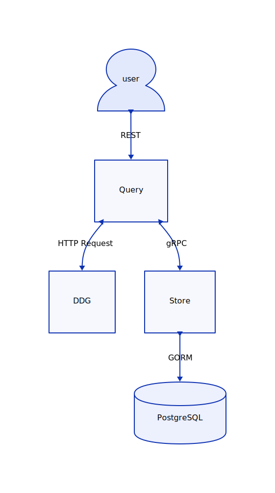

# goduckduckgo

## Overview

`goduckduckgo` is a set of microservices, answering client's queries by talking to [GDD's API](api.duckduckgo.com).
This project is a WIP playground to learn Golang with Software Engineering and Systems Design under the SRE discipline.

## Roadmap

- [x] Codebase Init
- [x] Package Build: Dockerfile
- [x] Makefile to support local dev and CI/CD operations
- [x] Add gRPC to connect Store with Query components
- [ ] Systems Design
- [ ] Unit and Functional tests
- [ ] Package Deploy: Helm Chart
- [ ] Release Engineering
- [ ] Telemetry: Logs
- [ ] Telemetry: Metrics
- [ ] Telemetry: Traces
- [ ] Monitoring: Alerting
- [ ] Monitoring: Visualization
- [ ] Monitoring: Analytics
- [ ] Intent-based Capacity Planning

## Directory Structure

```md
├── api               # API definition
├── build             # Builds dir
│   ├── ci            # CI configurations
│   └── package       # Images
├── deploy            # Deployment manifests
│   ├── helm-charts   # Helm Charts
│   ├── monitoring    # Rules,Dashboards SLOs
├── docs              # Dir for documentation related files
└── src               # Project level src for codebase
```

## Architecture

### Components

#### Query

Query exposes an API for users interaction. It provides the interfaces in order to be asked for queries and returned the DDG's answers.
Also, it handles the queries tasks such as:

- Caching queries with TTL
- Calling Store to store the query

#### Store

Store exposes a gRPC interface to interact with Query. It utilizes GORM to interact with a PostgreSQL. It handles the queries-answers persistency lifecycle with `CRUD` operations.

### Flow



## Release Engineering, Contributing and Git Flow

### Contributions

Contributions in this repo would follow the [conventional commits](https://www.conventionalcommits.org/en/v1.0.0/#specification) spec.

### Branching Flow and CI/CD

```md
for branches or tags do:

  - feat/new_feature:
    on every branch/pull request do:
      - Lint
      - Test
      - Build and Push Image package to registry with tag <branch_name>

  - master:
    on every push to master do:
      - Build and Push Image package to registry with tag <master>

  - tag:
    on tag push do:
      - Build and Push Image package to registry with tag <tag_semver>
      - Create a new GiHub release with multi-platform packages
```

### Hermetic Builds

- Make builds and computations, environment agnostic
- Use hashes, non-root users, and bare base images to respect immutability, security and optimizations
